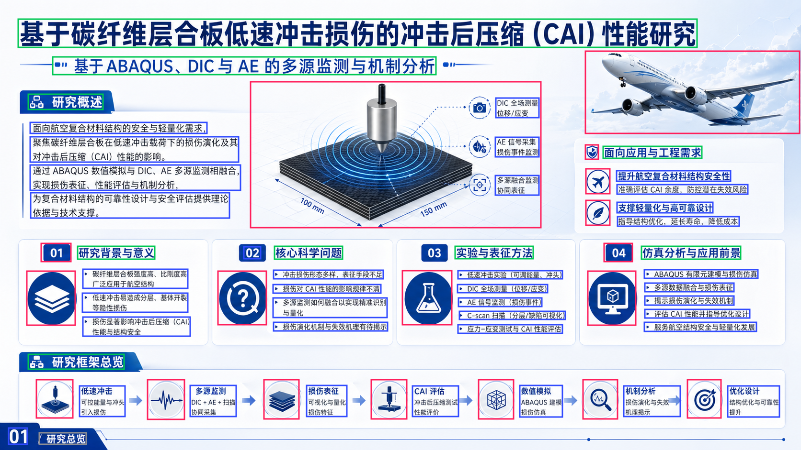
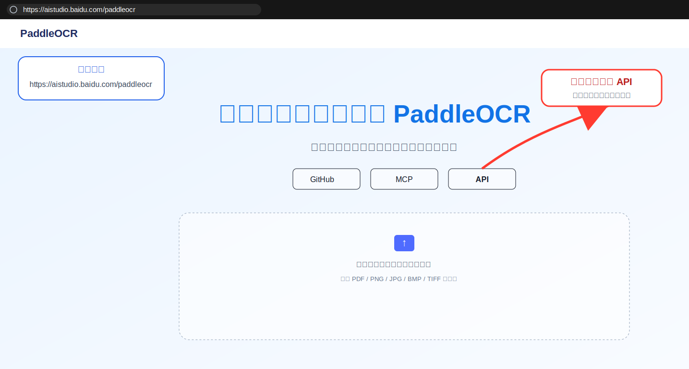
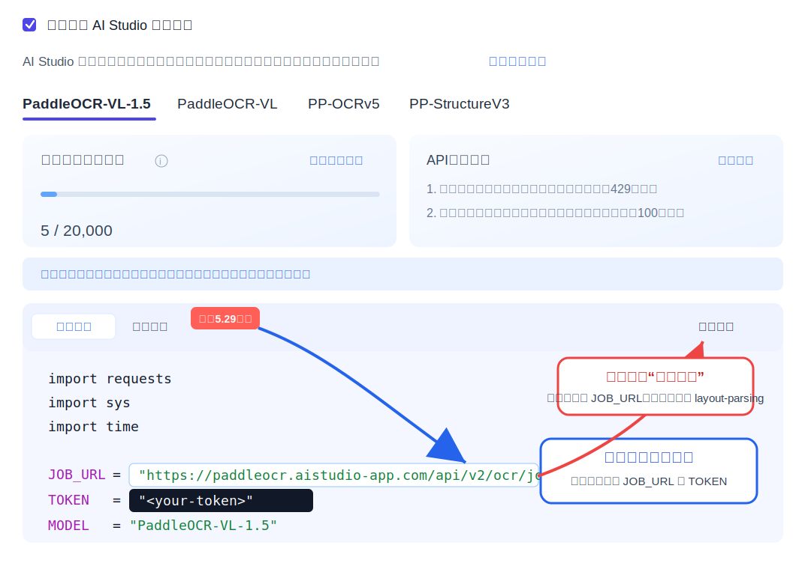

# image2pptx

基于 PaddleOCR-VL 的本地图片转 PPT 工具：上传文档图片获得 OCR JSON，再把 OCR JSON 和原图转换为可编辑的 `.pptx`。

项目目标是“版面尽量复刻 + 内容尽量可编辑”。文本会生成 PowerPoint 文本框，表格尽量生成原生表格，图片块会从原图按 OCR bbox 裁剪后作为独立图片放入 PPT。

## 效果预览

下面是 OCR 布局框与原图的对齐诊断图，用于检查 PaddleOCR 返回的 bbox 是否适合后续生成 PPT。



## 如何获取 PaddleOCR API

访问 PaddleOCR API 页面：

```text
https://aistudio.baidu.com/paddleocr
```

第一步，进入页面后点击中间的 `API` 按钮。



第二步，在 API 页面选择模型，点击“复制代码”，从示例代码中获取 `API_URL` 和 `TOKEN`。



第三步，启动本项目后，在前端“个人 PaddleOCR 配置”中填入：

- `API URL`：形如 `https://<your-app>.aistudio-app.com/layout-parsing`
- `Access Token`：AI Studio 访问令牌

Token 属于个人隐私，不要提交到 GitHub，也不要写入公开配置文件。

## 样例文件

仓库内置了一个首个验收样例：

- 源图片：[server/samples/summary.png](server/samples/summary.png)
- OCR JSON：[server/samples/summary.json](server/samples/summary.json)

本地启动后可以在页面中使用样例生成 PPT，也可以通过 `/api/ppt` 上传这两个文件验证转换链路。

## 技术栈

- 前端：React + Vite
- 后端：Node.js + Express + TypeScript
- OCR：通过服务端内置 PaddleOCR 文档解析脚本调用 `python vl_caller.py`
- PPT：PptxGenJS

## 本地运行

环境要求：

- Node.js 20+
- Python 3.10+
- 服务端已内置 PaddleOCR 文档解析调用脚本
- 可用的 PaddleOCR-VL API URL 和 Token

安装依赖：

```bash
npm install
```

安装 Python 依赖：

```bash
pip install -r server/paddleocr-doc-parsing/scripts/requirements.txt
```

开发模式：

```bash
npm run dev
```

前端默认访问：

```text
http://localhost:5173
```

构建并运行生产版本：

```bash
npm run build
npm run start
```

生产服务默认访问：

```text
http://localhost:3001
```

## PaddleOCR 配置

可以在前端页面填写个人 PaddleOCR-VL 配置，也可以通过环境变量配置：

```bash
PADDLEOCR_DOC_PARSING_API_URL=https://your-service/layout-parsing
PADDLEOCR_ACCESS_TOKEN=your_token
PADDLEOCR_DOC_PARSING_TIMEOUT=180000
PADDLEOCR_VL_CALLER_PATH=server/paddleocr-doc-parsing/scripts/vl_caller.py
PYTHON_BIN=python
```

Token 不会写入仓库。前端个人配置只保存在浏览器 `localStorage`。

后端默认调用仓库内置脚本：

```text
server/paddleocr-doc-parsing/scripts/vl_caller.py
```

如需调整脚本路径，优先设置 `PADDLEOCR_VL_CALLER_PATH`；如需指定 Python 解释器，设置 `PYTHON_BIN`。

## 核心功能

- 支持单张或多张图片 OCR。
- 支持上传 OCR JSON + 原图生成 PPT。
- 支持多页输出：一张图或 OCR 顶层一个 page 对应一页 slide。
- 默认使用“布局稳定优先”的 PaddleOCR 参数，避免文档预处理和去畸变导致 bbox 与原图错位。
- 读取 JSON 时兼容普通 UTF-8、UTF-8 BOM、UTF-16LE 和 UTF-16BE。

## API

### `POST /api/ocr`

`multipart/form-data`

字段：

- `image` 或 `images`：一张或多张图片
- `paddleApiUrl`：可选，覆盖 PaddleOCR endpoint
- `paddleAccessToken`：可选，覆盖 PaddleOCR token
- `paddleTimeoutMs`：可选，覆盖超时时间

返回：

- `rawJson`
- `normalizedDocument`
- `imageMeta`
- `imageMetas`

### `POST /api/ppt`

`multipart/form-data`

字段：

- `ocrJson` 或 `ocrJsonText`
- `sourceImage` 或 `sourceImages`
- `imageWidth` / `imageHeight`：没有原图时可选提供页面尺寸，但如果 JSON 中存在 image block，仍建议上传原图

返回 `.pptx` 文件流。

## JSON2PPTX 当前限制

`json2pptx` 部分仍有待优化，尤其是：

- 文本框长度和高度仍可能与原图存在偏差。
- 字号、行距、段落换行与原始图片不能保证完全一致。
- PaddleOCR 返回的 bbox 如果本身有偏移，PPT 中也会继承这种偏移。
- 表格会尽量转为原生 PowerPoint 表格，但复杂合并单元格和特殊样式还不能完全复刻。
- 图表、公式和混排内容当前以稳定可编辑为优先，不保证像素级还原。

因此当前版本适合作为“可编辑初稿生成器”。如果目标是完全视觉一致，后续需要继续优化文本测量、字号估计、bbox 后处理和复杂版式规则。

## 临时文件

上传文件、OCR 中间结果和生成的 PPT 会写入：

```text
server/tmp
```

该目录不会提交到 Git。

## License

MIT
